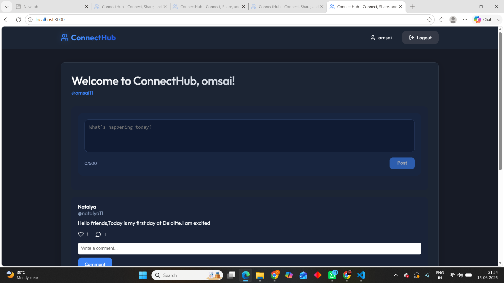
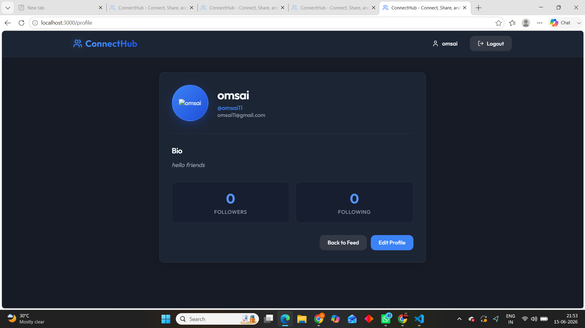
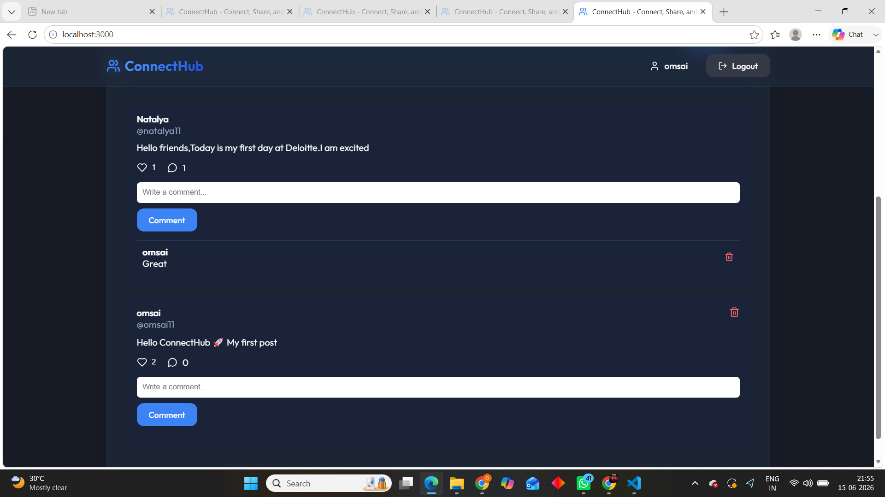

# ConnectHub - MERN Social Media Platform

ConnectHub is a full-stack social networking application built using the MERN Stack (MongoDB, Express.js, React.js, and Node.js). The platform allows users to create accounts, share posts, interact with content through likes and comments, manage personal profiles, and connect with other users.

---

## Project Overview

The objective of ConnectHub is to provide a modern social media experience with secure authentication, user interaction features, and responsive user interface design.

This project was developed as part of the **CodeAlpha Full Stack Development Internship Program**.

---

## Features

### Authentication & Authorization

* User Registration
* User Login
* JWT-Based Authentication
* Protected Routes
* Secure Password Hashing using bcrypt

### User Management

* View Profile
* Edit Profile Information
* Update Bio
* Update Profile Picture
* Follow Users
* Unfollow Users

### Posts

* Create New Posts
* View Feed Posts
* Delete Own Posts
* Real-Time Feed Updates

### Engagement Features

* Like Posts
* Unlike Posts
* Add Comments
* Delete Own Comments
* Comment Count Display
* Like Count Display

### User Experience

* Responsive Design
* Modern UI
* Loading States
* Error Handling
* Protected Navigation

---

## Technology Stack

### Frontend

* React.js
* React Router DOM
* Axios
* Lucide React Icons
* CSS3

### Backend

* Node.js
* Express.js
* MongoDB
* Mongoose

### Authentication

* JSON Web Tokens (JWT)
* bcryptjs

### Development Tools

* VS Code
* Git
* GitHub
* Nodemon

---

## Project Structure

```text
connecthub/
│
├── backend/
│   ├── config/
│   ├── controllers/
│   ├── middleware/
│   ├── models/
│   ├── routes/
│   ├── utils/
│   └── server.js
│
├── frontend/
│   ├── src/
│   │   ├── components/
│   │   ├── context/
│   │   ├── services/
│   │   ├── App.jsx
│   │   └── main.jsx
│   │
│   └── package.json
│
└── README.md
```
## Screenshots

### Home Feed



### Profile Page



### Comments Section



---

## Installation & Setup

### Clone Repository

```bash
git clone https://github.com/Omsaipriya11/connecthub.git
cd connecthub
```

### Backend Setup

```bash
cd backend
npm install
```

Create a .env file:

```env
PORT=5000
MONGO_URI=mongodb://localhost:27017/connecthub
JWT_SECRET=your_secret_key
NODE_ENV=development
```

Start Backend Server:

```bash
npm run dev
```

---

### Frontend Setup

```bash
cd frontend
npm install
npm run dev
```

Frontend will run on:

```text
http://localhost:3000
```

---

## Database Schema

### User

* Name
* Username
* Email
* Password
* Profile Picture
* Bio
* Followers
* Following

### Post

* Author
* Content
* Image
* Likes
* Comments
* Created At

### Comment

* User
* Comment Text
* Timestamp

---

## Security Features

* Password Encryption using bcrypt
* JWT Authentication
* Protected API Routes
* Authorization Checks
* Input Validation
* Error Handling Middleware

---

## Future Enhancements

* Image Upload Support
* Real-Time Chat
* Notifications System
* Dark/Light Theme Toggle
* Search Users
* Post Sharing
* Story Feature
* Deployment to Cloud Platforms

---

## Author

**Om Sai Priya**

Full Stack Development Intern

CodeAlpha Internship Program

---

## License

This project is developed for educational and internship purposes.
